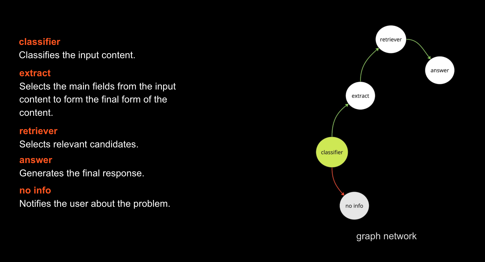

# Agent

This module represents the creation of an agent designed for efficient and intelligent task automation. The agent leverages **LangGraph** to organize workflows and **vLLM** to perform complex processing of resumes and vacancies. Below are the key features and launch instructions.

---

## 🚀 Features

1. **Workflow Based on LangGraph**:
   - Modular and extensible architecture
   - Easy integration of custom nodes and logic
   - High flexibility and maintainability

2. **Intelligent Processing Powered by vLLM**:
   - Accelerated inference with vLLM for reduced latency
   - Efficient handling of complex natural language processing tasks
   - Scalable for working with large models

3. **Customizable and Configurable**:
   - User-friendly API to define and expand the agent's capabilities
   - Support for additional integrations if needed

---

## 🛠 Launch Instructions

1. Start the vLLM server with the QWEN model:
   ```bash
   poetry run python -m agent.vllm_server.run
   ```

2. Fill example.txt with content related to a resume or vacancy.

3. Launch the Agent:
   ```bash
   poetry run python -m agent.main.py
   ```