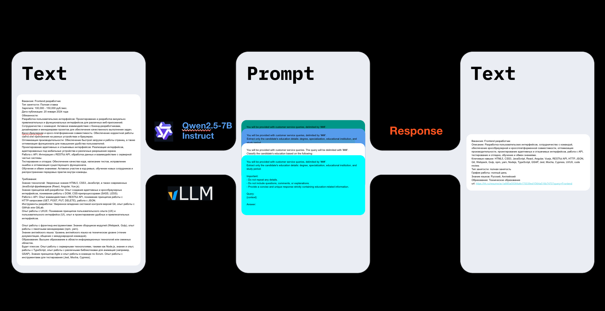

# 🛠️ Parser
  
This part of the project collects vacancies and resumes from the HeadHunter platform using their public API.
The received data undergoes preliminary processing: cleaning, normalization, and formatting into a unified structure — ready for analysis or further machine learning tasks.


# 🚀 How to Run
1. Get Data from HeadHunter
Collect vacancies or resumes by specifying your topic, area, page limits, and number of objects:
```python
poetry run python scraper/main.py --topic "Devops разработчик" --area 1 --limit_page 4 --limit_objects 100
```

2. Create a New Dataset
After collecting raw data, create a processed dataset:
```python
poetry run python scraper/forge_dataset.py
```

3. Create and Fill a New Database
Manage your database: delete a collection and create a new one for the IT area:
```python
poetry run python agent/database/main.py --act delete --coll_name it_area
```